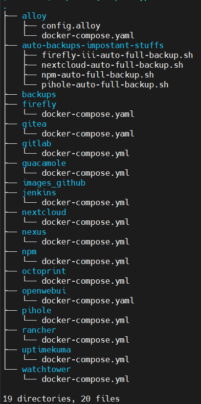

# Homelab Infrastructure

This repository contains my self-hosted homelab setup, built entirely with Docker and Docker Compose.
It serves as a central platform for personal projects, self-hosting, and experimenting with modern DevOps practices while keeping a strong focus on security and maintainability.

---

## 📌 Features

- Containerized services managed via docker-compose.yml files.

- Separation of concerns – each service stack (e.g., Nextcloud, Nginx Proxy Manager, Guacamole, etc.) is modular and can run independently.
- Security-first approach – no shortcuts such as disabling firewalls, SELinux, or AppArmor.

- Version control – all Compose configurations are tracked here for reproducibility.

- Documentation – clear setup and configuration notes to make redeployment straightforward.

---

## 🖼️ Architecture Overview

> _Example: Work dir tree:_




---


## 🧰 Prerequisites

- fully updated Linux server (security patches applied).
- Docker installed
- Docker Compose installed
- Firewall enabled (UFW, nftables, or equivalent).
- SELinux/AppArmor enabled (do not disable for convenience).
- **A commitment to: Security first – never bypass protections.**

---
## 🛠️ Technologies
- **Docker Engine** – container runtime.
- **Docker Compose** – orchestration.
- **MariaDB / PostgreSQL / MySQL** – databases for applications.
- **Nginx Proxy Manager** – reverse proxy with SSL/TLS automation.
- **Nextcloud** – self-hosted personal cloud storage.
- **Pihole** - DNS-based ad/tracker blocking.
- **Gitlab** - self-hosted Git repositories with DevOps features.
- **Gitea** - lightweight Git hosting alternative to GitLab.
- **Jenkins** - automation server for CI/CD pipelines.
- **uptimekuma** - monitoring and alerting for infrastructure health.
- **firefly** - personal finance manager.
- **nexus** - repository manager (Docker images, artifacts, etc.)
- **Octoprint** - 3D printer management (via USB or WiFi).
- **openwebui** - web interface for running local or remote LLMs.
- **alloy** - observability tool (replacement for Promtail, Loki, etc.)
- **Apache Guacamole** – browser-based remote desktop gateway.
- **Rancher** - container orchestration and Kubernetes management.
- **watchtower** -automatic Docker image update management.
- **BACKUPS** - custom scripts to back up critical volumes and data offsite.
-

---


## 📟 How to Use
1. Clone the Repository and enter project directory
```bash
git clone https://github.com/levrskn/homelab
cd homelab
```

2. Explore service directories. Review docker-compose.yml and .env files for configuration options.

3. Deploy a service (after adjusting configurations to your needs):
```bash
docker compose up -d
```


### Troubleshooting
If you run into issues while setting up or running containers, check the following:
- Firewall Rules – make sure required ports are open on your server.
- Network Access – verify your server has internet connectivity to pull Docker images.
- DNS Resolution – ensure your DNS server is reachable (Pi-hole or system DNS).
- Configuration Files – double-check .env and docker-compose.yml files for typos or missing variables.
- SELinux/AppArmor – confirm they are enabled and not blocking container access unexpectedly.
- Docker Permissions – verify your user is part of the docker group (or use sudo where required).

## 📃 License
Apache-2.0 license [©levrskn](https://github.com/levrskn)

---

## 💾  Author

Me on [GitHub](https://github.com/levrskn)

Me on [LinkedIn](https://linkedin.com/in/levrskn)
